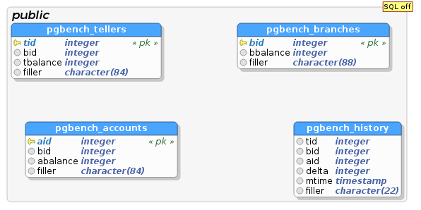

# Ficha Técnica

S.O: Debian GNU/Linux 8.0

PostgreSQL: 9.4

# Detalles de la prueba

## Escenario Genérico sin Llaves primarias

```bash
$ createdb pgbench
$ pgbench -i -s 10 pgbench
```

Se crean las tablas (`-i`) con una escala de `10`, es decir, 10 branches (sucursales),
100 (10 * 10) tellers (cajeros) y 1 millón de (100000 * 10) accounts (cuentas).

```bash
$ pgbench -c 4 -j 4 -T 60 pgbench
```

Donde `-c` es el número de clientes concurrentes, `-j` es el número de hilos,
`-T` el número de segundos que dura la prueba.



## Escenario Genérico con Llaves Primarias

```bash
$ createdb pgbenchfk
$ pgbench -i -s 10 --foreign-keys pgbenchfk
$ pgbench -c 4 -j 4 -T 60 pgbenchfk
```


\newpage

# Resultados

## Transacciones procesadas

Los valores altos son buenos.


|transacciones procesadas | transacciones procesadas fk |
|------|------|
| 2914 | 9281 |
| 4484 | 7637 |
| 4454 | 7860 |
| 4713 | 3873 |
| 5691 | 4065 |
| 5321 | 5573 |

\newpage

### Latencia

Los valores bajos son buenos.


| latencia promedio (ms) | latencia promedio fk (ms) |
|----|----|
| 82 | 28 |
| 53 | 31 |
| 53 | 36 |
| 78 | 62 |
| 42 | 59 |
| 45 | 43 |

\newpage

### TPS

Los valores altos son buenos.


| tps | tps fk |
|---|-----|
| 48| 142 |
| 74| 127 |
| 74| 111 |
| 78| 64 |
| 94| 67 |
| 88| 91 |

\newpage

# Database Benchmarking (bibliografía)

PostgreSQL se distribuye con un programa de benchmarking llamado `pgbench` que se
puede usar para una variedad de pruebas. Las pruebas que se incluyen por defecto
son útiles, además, incluye un lenguaje de scripting que permite adaptar las pruebas
de la base de datos. Incluso podemos usar el núcleo de `pgbench`; un programa para
base de datos eficiente, escalable y multi-cliente; para escribir completamente
pruebas a la medida. Existen algunas otras pruebas estándares de la industria
que permiten comparar a PostgreSQL con otras bases de datos, aúnque sin una auditoría
de los resultados en la mayoría de los datos.

## Pruebas por defecto de pgbench

La ispiración original para la prueba `pgbench` es la prueba llamada TPC-B desarrollada
Transaction Processing Performance Council (TPC): `http://www.tpc.org/tpcb/`.

...

## Definición de Tablas

The main table definition SQL adds these tables:

```sql
CREATE TABLE pgbench_branches(bid int not null, bbalance int, filler char(88));
ALTER TABLE pgbench_branches ADD primary key (bid);

CREATE TABLE pgbench_tellers(tid int not null, bid int, tbalance int, filler char(84);
ALTER TABLE pgbench_tellers ADD primary key (tid);

CREATE TABLE pgbench_accounts(aid int not null, bid int, abalance int, filler char(84));
ALTER TABLE pgbench_accounts ADD primary key (aid);

CREATE TABLE pgbench_history(tid int, bid int, aid int, delta int, mtime timestamp, filler char(22));
```

La intención de varios campos de filtrado es asegurarse que cada fila insertada
en la base de dato es realmente de 100 bytes. De hecho esto no trabaja como ...

De lo que deberíamos darnos cuenta es que cada tipo de registro insertado por la
prueba estándar de pgbench es extremadamente limitado, solo un pequeño número de
bytes se insertan en cada uno de los registros. En la practica, siempre el más
pequeño `INSERT` o `UPDATE` usará una página de base de datos estándar de 8K y
requiere siempre este tamaño cuando escribe. El hecho de que solo una fracción es
usada después de cada cambio ayuda a reducir el volumen WAL escrito, pero solo una
vez que hemos escrito el usual `full_page_writes` de copia para cada página, lo que
terminará de cualquier manera como el volumen del procesamiento WAL actual.

## Detección de la Escala

El número de branches (sucursales) representa la escala, cada branch tiene 10 tellers
(cajeros) y 100.000 accounts (cuentas) en la base de datos. Este valor
es introducido cuando inicualizamos la base de datos `pgbench` y las tablas son creadas.
Abajo hay un ejemplo que muestra como crear un base de datos para `pgbench` y como
poblarla:

```bash
$ createdb pgbench

$ pgbench -i -s 10 pgbench
```

Esto inicializa (-i) las tablas para pgbench usando una scala de 10 (-s 10) dentro
de la base de datos llamada `pgbench`. No necesitamos usar el nombre por que es una
convención.

Cuando `pgbench` se ejecuta en modo regular (no inicializando), este primero revisa
si manualmente dijimos la escala de base de datos `-s` que usar; si es así, se usa
ese valor. Si no es así, se ejecutara al escala de las pruebas por defecto, `pgbench`
intentará detectar la escala usando la siguiente consulta:

```sql
SELECT count(*) FROM pgbench_branches;
```

NOTA: para nosotros la escala son los aspirantes (~300.000), pero para una UE la
escala parece ser las aulas.

## Definición del Script de Consulta

Como en la tabla con código de arriba, el código verdadero

se copilan in su código fuente, la única manera en que podemos verlos es revisando
la documentación `http://www.postgresql.org/docs/current/static/pgbench.html`.

El script de transacción por defecto que es llamado también transacción "tipo TPC-B"
cuando ejecutamos la prueba (y a la que nos referimos aquí como una transacción "TPC-B-like") presenta siete comandos por transacción. Dentro del programo
esto tiene el aspecto siguiente:

```sql
\set nbranches :scale
\set ntellers 10 * :scale
\set naccounts 100000 * :scale
\setrandom aid 1 :naccounts
\setrandom bid 1 :nbranches
\setramdom tid 1 :ntellers
\setramdom delta -5000 5000
BEGIN;
UPDATE pgbench_accounts SET abalance = abalance + :delta WHERE aid = :aid;
SELECT abalance FROM pgbench_accounts WHERE aid = :aid;
UPDATE pgbench_tellers SET tbalance = tbalance + :delta WHERE tid = :tid;
UPDATE pgbench_branches SET bbalance = bbalance + :delta WHERE bid = :bid;
INSERT INTO pgbench_history (tid, bid, aid, delta, mtime) VALUES (:tid, :bid, :aid, :delta, CURRENT_TIMESTAMP);
END;
```

Las primeras tres líneas computan cuantos branches, tellers y accounts tiene esta
base de datos basado en la `:scale`, que es un nombre de variable especial que coloca
la escala de la base de datos que se determina usando la lógica descrita en la sección
anterior.

Las siguientes cuatro líneas crean valores aleatorios que se usan para simular una
transacción bancaria donde alguien fue a un cajero específico de una agencia específica
y depositó o retiró alguna cantidad de dinero de su cuenta.

The presumption that one is using...

Lo principal aquí es las cinco sentencias envueltas en el bloque transacción...

Cada una de las sentencias tiene un impacto práctico muy diferente:

* `UPDATE pgbench_accounts`: Siendo la tabla más grande esta es por mucho la sentencia
más probable de disparar I/O de disco.

* `SELECT abalance`: Como el `UPDATE` anterior ha dejado la información necesaria
para responder esta consulta en la caché, esta agrega muy poca carga de trabajo
para la prueba TPC-B-like.

* `UPDATE pgbench_tellers`: Como hay muchos menos cajeros que cuentas esta tabla
es pequeña y esta probablemente cacheada en RAM, pero aunque es pequeña tiende a
ser la fuente de problemas de bloqueo.

* `UPDATE pgbench_branches`: Siendo una tabla extremadamente pequeña todo su contenido
esta ya probablemente cacheado y esencialmente libre de acceso. Sin embargo, por que
es pequeña el bloqueo puede convertirse en un cuello de botella si usamos una escala
pequeña y muchos clientes. De acuerdo con la recomenación general siempre es mejor
asegurarse que la escala es mayor que los clientes para cualquier prueba que ejecutemos.
En al practica, este problema no es realmente lo que importa aunque se puede ver
en una de los ejemplos de abajo. Las I/O de disco sobre la tabla cuentas y la
velocidad del commmit será una limitación mayor que el bloqueo en la mayoría de los casos.

* `INSERT INTO pgbench_history`: La tabla de historia actuá como una tabla apéndice
que nunca se actualiza o se consulta luego, en consecuencia esta ni siquiera
tiene índices. Además, estas inserciones resultan tener un bajo volumen de escritura
en comparación con las más costosos sentencias UPDATE indexadas.

Esta esta prueba por defecto. Existen otras dos:

`-N`: Lo mismo que la anterior pero salta las dos pequeñas sentencias `UPDATE` que
impactan a la tabla `teller` y `branch`. Esto reduce los problemas de bloqueo de tablas
mientras mantiene las operaciones pesadas de escritura.

`-S`: Solo ejecuta la sentencia `SELECT` sobre la tabla `account`, por lo que tampoco
será necesario envolverla en un bloque de transacciones.

... pero ejecutar solo sentencias `SELECT` es muy útil para examinar el tamaño de
la cache en nuestro sistema operativo y para medir la velocidad máximo de CPU.

## Ejecutar pgbench Manualmente

Como un ejemplo simple de ejecución de una prueba podemos ejecutar una prueba de
solo lectura para un pequeño número de transacciones. Aquí esta una prueba rápida
para el servidor de prueba:

```bash
$ pgbench -S -c 4 -t 20000 pgbench
```

Esta es la simulación del escenario donde cuatro clientes de base de datos están
activos al mismo tiempo y continuamente consultando los datos. Cada cliente está
en ejecución hasta que se ejecuta el número de peticiones de las transacciones.

Since this is a Linux...
Como este es un sistema GNU/Linux
Usar más de un hilo (solo disponible desde PostgreSQL 9.0) muestra una mejora dramática
de la velocidad.


```bash
```


## Pruebas a la medida con pgbench

Aúnque las pruebas incluidas son interesantes podemos usar pgbench para ejecutar
pruebas de estrés sobre nuestra propia base de datos. Nos permite ejecutar varios
clientes en uno y ejecutar consultas concurrentes en un script pequeño.

### Probar la velocidad de inserción

Para dar una idea de como esto puede ser útil imaginemos que queremos probar cuan
rápido nuestro sistema puede escribir información usando `INSERT`. Podemos copiar el
concepto *filler* (descripción) de las tablas incluidas por defecto en donde queremos
crear una cadena de caracteres con un tamaño particular y por consiguiente un tamaño
en bytes, sin preocuparnos del contenido (este se incluyen en `pgbench-tools` como
`init/insertsize.sql`):

```sql
CREATE TABLE data (filler text);
```

Para luego crear un script a la medida que llena

```sql
INSERT INTO data (filler) VALUES (repeat('X',:scale));
```

Esto toma prestado el concepto de "escala" de la prueba regular y lo usa para
especificar el tamaño de los datos insertados. Podemos crear nuestras propias
variables con otros nombres pasando los valores desde la línea de comandos para
luego referirnos a ellos dentro del script.

Abajo se muestra un ejemplo de instalación y uso de una versión de ejemplo incluida
en `pgbench-tools`, seguido por la ejecución manual de esta prueba con `pgbench`:

```bash
$ cretedb insert
$ psql -d insert -f init/insertsize.sql
$ pgbench -s 1000 -f tests/insert-size.sql -n -c 4 -t 25000 insert
```

Como con la mayoría de las pruebas a la medida tenemos que especificar manualmente
la escala para colocarla correctamente y saltar el paso del `VACUUM` que normalmente
sería hecho sobre la tabla estándar con `-n`.

Estos datos no son interesante por ellos mismos pero si actualizamos la parte final
de la configuración de `pgbench-tools` para ejecutar esta prueba variando la cantidad
de clientes y el tamaño.

```bash
SCALES="10 100 1000 10000"
SCRIPT="insert-size.sql"
TOTTRANS=100000
SETTIMES=1
SETCLIENTS="1 2 4 8 16"
SKIPINIT=1
```
Y luego ejecutar este conjunto y probablemente veremos emerger un patrón más interesante.
En la prueba sobre mi sistema, las sentencias `INSERT` por segundo no varían mucho
si escribimos 1 o 100000 bytes en cada una. Esto está primeramente relacionado con
la velocidad de escritura del disco que es siempre mucho menos que la velocidad
de la tasa secuencial de escritura disco.

Pero una vez que hemos alcanzado un número suficientemente grande de clientes combinados
con más bytes escritos en cada ocasión, eventualmente la tasa total de `INSERT`
completados por segundo comienza a disminuir. Encontrar este punto, cantidad actual
del disco escrito usando la herramienta de monitoreo del SO, habremos determinado
el punto en que no es capaz de escribir nuevos datos en la base de datos, bajo una
carga de trabajo actual (algo que nos es muy fácil de medir directamente).

This is a modertely...

## Graficar los resultados con pgbench-tools

### Configurar pgbench-tools

```bash
$ cd pgbench-tools/
$ createdb pgbench
$ createdb results
$ psql -d results -f init/resultdb.sql
```

This may...

The results...

Una vez que sabemos donde cada base de datos se encuentra vamos a editar el archivo
`config` en la raíz del directorio `pgbench-tools` y actualizar
los valores de las variables `TEST` y `RESULT`. Podemos ajustar el número de hilos
de trabajo; ver las notas sobre esto en las secciones siguientes y en la documentación
de `pgbench-tools`.

### Customizing 8.3

If you're using

### Ejemplo de los resultados de pgbench

Todos estos vienen desde el ejemplo del servidor y configuración que se describió
y el tipo de gráficos que se genera con `pgbench-tools` cada vez que se ejecuta.
Estos resultados se crearon con PostgreSQL 9.0 que permite llegar hasta cuatro
hilos de trabajo de `pgbench` (uno por núcleo).

##Análisis de latencia

La mayoría del tiempo puedes pensar en la **latencia** (el tiempo que toma procesar
una transacción) como la inversa de las transaccions sobre segundos. Sin
embargo, en el peor caso la latencia es un valor extremadamente importante para
tomar en cuenta en muchas aplicaciones y no podemos determinarlo con ningún
promedio de TPS.

# Resumen

Benchmarking una base de datos es un tema muy extenso y en este capítulo solo introduce
los conceptos principales. Teniendo la herramienta `pgbench` empaquetada en nuestra
base de datos es handy para hacer pequeñas pruebas pero necesitamos ser cuidadosos
de sus limitaciones antes de que rely demasiado nuestros resultados en nuestros
esfuerzos de ajustar el rendimiento.

* La base para las pruebas incluidas en pgbench están desactualizadas,...

$ pandoc 8_database_benchmarking.md --latex-engine=xelatex -o 8_database_benchmarking.pdf
$ pandoc -s -t rst --toc 8_database_benchmarking.md -o 8_database_benchmarking.rst

aptitude install gnuplot sysstat
